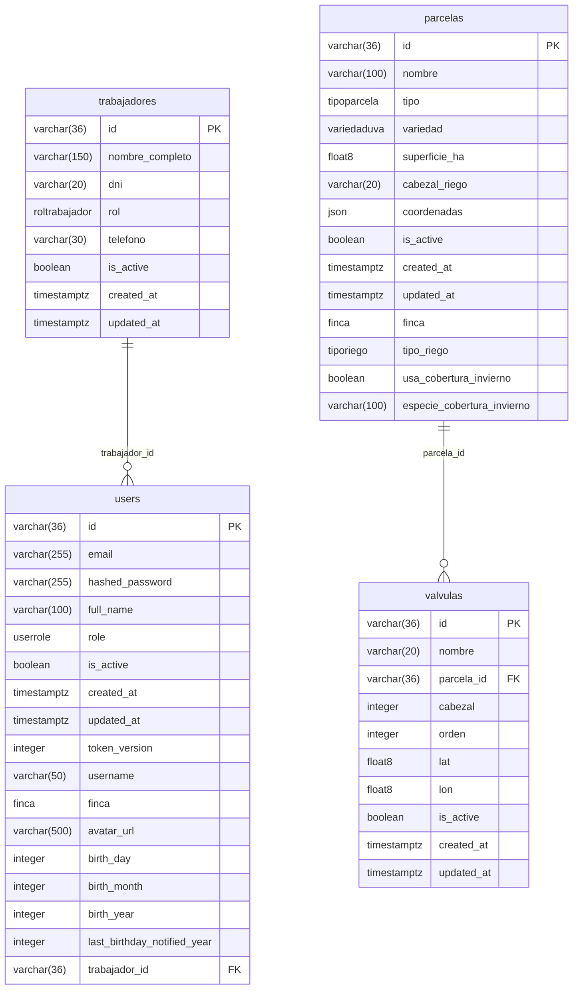
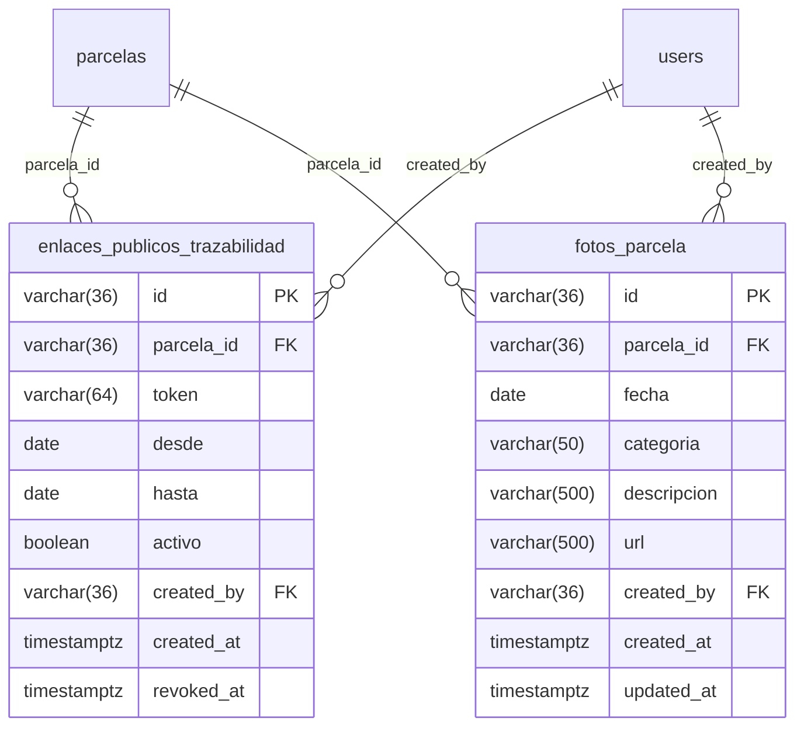
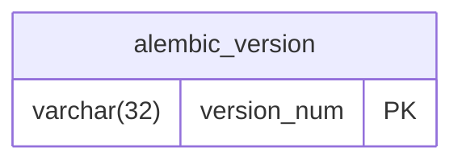

# Modelo de Datos

> ⚠️ Generado automáticamente por `scripts/generate_modelo_datos.py` el 2026-09-25 desde el esquema real de producción. **No editar a mano** -- correr el script de nuevo después de cualquier migración de Alembic.

**34 tablas** · **9 vistas** · **33 enums** · **58 relaciones**

## Panorama general

Todas las relaciones (FK), sin columnas -- para ver cómo se conecta todo de un vistazo.

```mermaid
erDiagram
    users ||--o{ alertas_descartadas : ""
    users ||--o{ analisis_calidad : ""
    parcelas ||--o{ analisis_calidad : ""
    users ||--o{ ciclos_campana : ""
    parcelas ||--o{ ciclos_campana : ""
    egresos ||--o{ comprobantes_arca_importados : ""
    lotes_importacion_arca ||--o{ comprobantes_arca_importados : ""
    users ||--o{ comprobantes_arca_importados : ""
    ingresos ||--o{ comprobantes_arca_importados : ""
    parcelas ||--o{ egresos : ""
    users ||--o{ egresos : ""
    parcelas ||--o{ enlaces_publicos_trazabilidad : ""
    users ||--o{ enlaces_publicos_trazabilidad : ""
    users ||--o{ estados_variedad_campana : ""
    users ||--o{ fotos_parcela : ""
    parcelas ||--o{ fotos_parcela : ""
    users ||--o{ fotos_registros_fitosanitarios : ""
    registros_fitosanitarios ||--o{ fotos_registros_fitosanitarios : ""
    users ||--o{ ingresos : ""
    lotes_importacion_termografo ||--o{ lecturas_termografo : ""
    users ||--o{ lotes_importacion_arca : ""
    users ||--o{ lotes_importacion_termografo : ""
    users ||--o{ mensajes_whatsapp_pendientes : ""
    egresos ||--o{ mensajes_whatsapp_pendientes : ""
    users ||--o{ metas_produccion : ""
    parcelas ||--o{ metas_produccion : ""
    users ||--o{ movimientos_stock : ""
    registros_fitosanitarios ||--o{ movimientos_stock : ""
    insumos ||--o{ movimientos_stock : ""
    planes_fitosanitarios ||--o{ ordenes_aplicacion : ""
    insumos ||--o{ ordenes_aplicacion : ""
    users ||--o{ ordenes_aplicacion : ""
    registros_fitosanitarios ||--o{ ordenes_aplicacion_parcelas : ""
    ordenes_aplicacion ||--o{ ordenes_aplicacion_parcelas : ""
    parcelas ||--o{ ordenes_aplicacion_parcelas : ""
    insumos ||--o{ planes_fitosanitarios : ""
    users ||--o{ planes_fitosanitarios : ""
    parcelas ||--o{ precios_tarea : ""
    users ||--o{ precios_tarea : ""
    users ||--o{ presupuestos : ""
    users ||--o{ push_tokens : ""
    parcelas ||--o{ registros_cosecha : ""
    users ||--o{ registros_cosecha : ""
    insumos ||--o{ registros_fitosanitarios : ""
    parcelas ||--o{ registros_fitosanitarios : ""
    users ||--o{ registros_fitosanitarios : ""
    trabajadores ||--o{ registros_fitosanitarios : ""
    parcelas ||--o{ registros_riego : ""
    trabajadores ||--o{ registros_riego : ""
    users ||--o{ registros_riego : ""
    users ||--o{ registros_trabajo : ""
    trabajadores ||--o{ registros_trabajo : ""
    parcelas ||--o{ registros_trabajo : ""
    users ||--o{ telefonos_usuarios_whatsapp : ""
    trabajadores ||--o{ users : ""
    parcelas ||--o{ valvulas : ""
```



## Núcleo (usuarios, trabajadores, parcelas)



### `users`

| Columna | Tipo | Null | Clave |
|---|---|---|---|
| `id` | varchar(36) | NOT NULL | PK |
| `email` | varchar(255) | NOT NULL |  |
| `hashed_password` | varchar(255) | NOT NULL |  |
| `full_name` | varchar(100) | NOT NULL |  |
| `role` | userrole | NOT NULL |  |
| `is_active` | boolean | NOT NULL |  |
| `created_at` | timestamptz | NOT NULL |  |
| `updated_at` | timestamptz | NOT NULL |  |
| `token_version` | integer | NOT NULL |  |
| `username` | varchar(50) | NOT NULL |  |
| `finca` | finca | NOT NULL |  |
| `avatar_url` | varchar(500) |  |  |
| `birth_day` | integer |  |  |
| `birth_month` | integer |  |  |
| `birth_year` | integer |  |  |
| `last_birthday_notified_year` | integer |  |  |
| `trabajador_id` | varchar(36) |  | FK → `trabajadores.id` |

### `trabajadores`

| Columna | Tipo | Null | Clave |
|---|---|---|---|
| `id` | varchar(36) | NOT NULL | PK |
| `nombre_completo` | varchar(150) | NOT NULL |  |
| `dni` | varchar(20) |  |  |
| `rol` | roltrabajador | NOT NULL |  |
| `telefono` | varchar(30) |  |  |
| `is_active` | boolean | NOT NULL |  |
| `created_at` | timestamptz | NOT NULL |  |
| `updated_at` | timestamptz | NOT NULL |  |

### `parcelas`

| Columna | Tipo | Null | Clave |
|---|---|---|---|
| `id` | varchar(36) | NOT NULL | PK |
| `nombre` | varchar(100) | NOT NULL |  |
| `tipo` | tipoparcela | NOT NULL |  |
| `variedad` | variedaduva |  |  |
| `superficie_ha` | float8 |  |  |
| `cabezal_riego` | varchar(20) |  |  |
| `coordenadas` | json |  |  |
| `is_active` | boolean | NOT NULL |  |
| `created_at` | timestamptz | NOT NULL |  |
| `updated_at` | timestamptz | NOT NULL |  |
| `finca` | finca |  |  |
| `tipo_riego` | tiporiego |  |  |
| `usa_cobertura_invierno` | boolean | NOT NULL |  |
| `especie_cobertura_invierno` | varchar(100) |  |  |

### `valvulas`

| Columna | Tipo | Null | Clave |
|---|---|---|---|
| `id` | varchar(36) | NOT NULL | PK |
| `nombre` | varchar(20) | NOT NULL |  |
| `parcela_id` | varchar(36) | NOT NULL | FK → `parcelas.id` |
| `cabezal` | integer | NOT NULL |  |
| `orden` | integer |  |  |
| `lat` | float8 | NOT NULL |  |
| `lon` | float8 | NOT NULL |  |
| `is_active` | boolean | NOT NULL |  |
| `created_at` | timestamptz | NOT NULL |  |
| `updated_at` | timestamptz | NOT NULL |  |

## Producción de campo

```mermaid
erDiagram
    users ||--o{ analisis_calidad : "created_by"
    parcelas ||--o{ analisis_calidad : "parcela_id"
    users ||--o{ ciclos_campana : "created_by"
    parcelas ||--o{ ciclos_campana : "parcela_id"
    users ||--o{ estados_variedad_campana : "created_by"
    users ||--o{ metas_produccion : "created_by"
    parcelas ||--o{ metas_produccion : "parcela_id"
    parcelas ||--o{ precios_tarea : "parcela_id"
    users ||--o{ precios_tarea : "created_by"
    parcelas ||--o{ registros_cosecha : "parcela_id"
    users ||--o{ registros_cosecha : "created_by"
    parcelas ||--o{ registros_riego : "parcela_id"
    trabajadores ||--o{ registros_riego : "responsable_id"
    users ||--o{ registros_riego : "created_by"
    users ||--o{ registros_trabajo : "created_by"
    trabajadores ||--o{ registros_trabajo : "trabajador_id"
    parcelas ||--o{ registros_trabajo : "parcela_id"
    registros_trabajo {
        varchar(36) id PK
        date fecha
        varchar(36) parcela_id FK
        varchar(100) trabajador_nombre
        clasificaciontarea clasificacion
        varchar(100) tarea
        numeric(10,2) cantidad
        unidadmedida unidad_medida
        numeric(10,2) precio_unitario
        numeric(15,2) monto_total
        varchar(500) detalle
        varchar(36) created_by FK
        timestamptz created_at
        timestamptz updated_at
        varchar(36) trabajador_id FK
        varchar(36) idempotency_key
    }
    registros_riego {
        varchar(36) id PK
        date fecha
        varchar(36) parcela_id FK
        varchar(20) cabezal
        varchar(20) valvula
        timestamptz inicio
        timestamptz fin
        float8 duracion_horas
        float8 mm_aplicados
        varchar(100) fertilizante_nombre
        float8 fertilizante_dosis_lt_ha
        varchar(100) responsable
        varchar(36) created_by FK
        timestamptz created_at
        timestamptz updated_at
        varchar(36) idempotency_key
        varchar(36) responsable_id FK
    }
    registros_cosecha {
        varchar(36) id PK
        integer temporada
        integer semana
        date fecha
        varchar(36) parcela_id FK
        cultivocosecha cultivo
        varchar(100) variedad
        varchar(50) n_remito
        varchar(50) n_ciu
        destinocosecha destino
        varchar(150) comprador
        varchar(150) cuadrilla
        varchar(150) acarreo
        varchar(20) vehiculo_patente
        tipoenvase tipo_envase
        float8 cantidad_envases
        float8 peso_unitario_kg
        float8 bruto_kg
        float8 tara_kg
        float8 kg_total
        varchar(500) imagen_remito_url
        varchar(500) observaciones
        varchar(36) created_by FK
        timestamptz created_at
        timestamptz updated_at
        varchar(36) idempotency_key
        origencosecha origen
        varchar(150) proveedor_tercero
    }
    precios_tarea {
        varchar(36) id PK
        integer temporada
        varchar(100) tarea
        varchar(36) parcela_id FK
        unidadmedida unidad_medida
        numeric(10,2) precio_unitario
        varchar(36) created_by FK
        timestamptz created_at
        timestamptz updated_at
    }
    metas_produccion {
        varchar(36) id PK
        integer temporada
        varchar(36) parcela_id FK
        numeric(12,2) kg_plan
        varchar(500) notas
        varchar(36) created_by FK
        timestamptz created_at
        timestamptz updated_at
    }
    ciclos_campana {
        varchar(36) id PK
        varchar(36) parcela_id FK
        integer anio
        estadofenologico estado_fenologico
        date fecha_estado
        numeric(10,2) rendimiento_kg_ha
        varchar(1000) observaciones
        varchar(36) created_by FK
        timestamptz created_at
        timestamptz updated_at
    }
    estados_variedad_campana {
        varchar(36) id PK
        variedaduva variedad
        integer anio
        estadocampana estado_campana
        date fecha_confirmacion
        varchar(1000) observaciones
        varchar(36) created_by FK
        timestamptz created_at
    }
    analisis_calidad {
        varchar(36) id PK
        varchar(36) parcela_id FK
        date fecha
        origenanalisis origen
        float8 brix
        float8 acidez
        float8 ph
        estadosanitarioanalisis estado_sanitario
        varchar(150) laboratorio_nombre
        varchar(500) informe_url
        varchar(1000) observaciones
        varchar(36) created_by FK
        timestamptz created_at
        timestamptz updated_at
    }
```

### `registros_trabajo`

| Columna | Tipo | Null | Clave |
|---|---|---|---|
| `id` | varchar(36) | NOT NULL | PK |
| `fecha` | date | NOT NULL |  |
| `parcela_id` | varchar(36) |  | FK → `parcelas.id` |
| `trabajador_nombre` | varchar(100) | NOT NULL |  |
| `clasificacion` | clasificaciontarea | NOT NULL |  |
| `tarea` | varchar(100) | NOT NULL |  |
| `cantidad` | numeric(10,2) | NOT NULL |  |
| `unidad_medida` | unidadmedida | NOT NULL |  |
| `precio_unitario` | numeric(10,2) | NOT NULL |  |
| `monto_total` | numeric(15,2) | NOT NULL |  |
| `detalle` | varchar(500) |  |  |
| `created_by` | varchar(36) | NOT NULL | FK → `users.id` |
| `created_at` | timestamptz | NOT NULL |  |
| `updated_at` | timestamptz | NOT NULL |  |
| `trabajador_id` | varchar(36) |  | FK → `trabajadores.id` |
| `idempotency_key` | varchar(36) |  |  |

### `registros_riego`

| Columna | Tipo | Null | Clave |
|---|---|---|---|
| `id` | varchar(36) | NOT NULL | PK |
| `fecha` | date | NOT NULL |  |
| `parcela_id` | varchar(36) | NOT NULL | FK → `parcelas.id` |
| `cabezal` | varchar(20) | NOT NULL |  |
| `valvula` | varchar(20) | NOT NULL |  |
| `inicio` | timestamptz | NOT NULL |  |
| `fin` | timestamptz |  |  |
| `duracion_horas` | float8 |  |  |
| `mm_aplicados` | float8 |  |  |
| `fertilizante_nombre` | varchar(100) |  |  |
| `fertilizante_dosis_lt_ha` | float8 |  |  |
| `responsable` | varchar(100) | NOT NULL |  |
| `created_by` | varchar(36) | NOT NULL | FK → `users.id` |
| `created_at` | timestamptz | NOT NULL |  |
| `updated_at` | timestamptz | NOT NULL |  |
| `idempotency_key` | varchar(36) |  |  |
| `responsable_id` | varchar(36) |  | FK → `trabajadores.id` |

### `registros_cosecha`

| Columna | Tipo | Null | Clave |
|---|---|---|---|
| `id` | varchar(36) | NOT NULL | PK |
| `temporada` | integer | NOT NULL |  |
| `semana` | integer |  |  |
| `fecha` | date | NOT NULL |  |
| `parcela_id` | varchar(36) |  | FK → `parcelas.id` |
| `cultivo` | cultivocosecha | NOT NULL |  |
| `variedad` | varchar(100) |  |  |
| `n_remito` | varchar(50) |  |  |
| `n_ciu` | varchar(50) |  |  |
| `destino` | destinocosecha | NOT NULL |  |
| `comprador` | varchar(150) |  |  |
| `cuadrilla` | varchar(150) |  |  |
| `acarreo` | varchar(150) |  |  |
| `vehiculo_patente` | varchar(20) |  |  |
| `tipo_envase` | tipoenvase | NOT NULL |  |
| `cantidad_envases` | float8 |  |  |
| `peso_unitario_kg` | float8 |  |  |
| `bruto_kg` | float8 |  |  |
| `tara_kg` | float8 |  |  |
| `kg_total` | float8 | NOT NULL |  |
| `imagen_remito_url` | varchar(500) |  |  |
| `observaciones` | varchar(500) |  |  |
| `created_by` | varchar(36) | NOT NULL | FK → `users.id` |
| `created_at` | timestamptz | NOT NULL |  |
| `updated_at` | timestamptz | NOT NULL |  |
| `idempotency_key` | varchar(36) |  |  |
| `origen` | origencosecha | NOT NULL |  |
| `proveedor_tercero` | varchar(150) |  |  |

### `precios_tarea`

| Columna | Tipo | Null | Clave |
|---|---|---|---|
| `id` | varchar(36) | NOT NULL | PK |
| `temporada` | integer | NOT NULL |  |
| `tarea` | varchar(100) | NOT NULL |  |
| `parcela_id` | varchar(36) |  | FK → `parcelas.id` |
| `unidad_medida` | unidadmedida | NOT NULL |  |
| `precio_unitario` | numeric(10,2) | NOT NULL |  |
| `created_by` | varchar(36) | NOT NULL | FK → `users.id` |
| `created_at` | timestamptz | NOT NULL |  |
| `updated_at` | timestamptz | NOT NULL |  |

### `metas_produccion`

| Columna | Tipo | Null | Clave |
|---|---|---|---|
| `id` | varchar(36) | NOT NULL | PK |
| `temporada` | integer | NOT NULL |  |
| `parcela_id` | varchar(36) | NOT NULL | FK → `parcelas.id` |
| `kg_plan` | numeric(12,2) | NOT NULL |  |
| `notas` | varchar(500) |  |  |
| `created_by` | varchar(36) | NOT NULL | FK → `users.id` |
| `created_at` | timestamptz | NOT NULL |  |
| `updated_at` | timestamptz | NOT NULL |  |

### `ciclos_campana`

| Columna | Tipo | Null | Clave |
|---|---|---|---|
| `id` | varchar(36) | NOT NULL | PK |
| `parcela_id` | varchar(36) | NOT NULL | FK → `parcelas.id` |
| `anio` | integer | NOT NULL |  |
| `estado_fenologico` | estadofenologico | NOT NULL |  |
| `fecha_estado` | date | NOT NULL |  |
| `rendimiento_kg_ha` | numeric(10,2) |  |  |
| `observaciones` | varchar(1000) |  |  |
| `created_by` | varchar(36) | NOT NULL | FK → `users.id` |
| `created_at` | timestamptz | NOT NULL |  |
| `updated_at` | timestamptz | NOT NULL |  |

### `estados_variedad_campana`

| Columna | Tipo | Null | Clave |
|---|---|---|---|
| `id` | varchar(36) | NOT NULL | PK |
| `variedad` | variedaduva | NOT NULL |  |
| `anio` | integer | NOT NULL |  |
| `estado_campana` | estadocampana | NOT NULL |  |
| `fecha_confirmacion` | date | NOT NULL |  |
| `observaciones` | varchar(1000) |  |  |
| `created_by` | varchar(36) | NOT NULL | FK → `users.id` |
| `created_at` | timestamptz | NOT NULL |  |

### `analisis_calidad`

| Columna | Tipo | Null | Clave |
|---|---|---|---|
| `id` | varchar(36) | NOT NULL | PK |
| `parcela_id` | varchar(36) | NOT NULL | FK → `parcelas.id` |
| `fecha` | date | NOT NULL |  |
| `origen` | origenanalisis | NOT NULL |  |
| `brix` | float8 |  |  |
| `acidez` | float8 |  |  |
| `ph` | float8 |  |  |
| `estado_sanitario` | estadosanitarioanalisis |  |  |
| `laboratorio_nombre` | varchar(150) |  |  |
| `informe_url` | varchar(500) |  |  |
| `observaciones` | varchar(1000) |  |  |
| `created_by` | varchar(36) | NOT NULL | FK → `users.id` |
| `created_at` | timestamptz | NOT NULL |  |
| `updated_at` | timestamptz | NOT NULL |  |

## Fitosanitarios, insumos y órdenes de aplicación

```mermaid
erDiagram
    users ||--o{ fotos_registros_fitosanitarios : "created_by"
    registros_fitosanitarios ||--o{ fotos_registros_fitosanitarios : "registro_fitosanitario_id"
    users ||--o{ movimientos_stock : "created_by"
    registros_fitosanitarios ||--o{ movimientos_stock : "registro_fitosanitario_id"
    insumos ||--o{ movimientos_stock : "insumo_id"
    planes_fitosanitarios ||--o{ ordenes_aplicacion : "plan_fitosanitario_id"
    insumos ||--o{ ordenes_aplicacion : "insumo_id"
    users ||--o{ ordenes_aplicacion : "created_by"
    registros_fitosanitarios ||--o{ ordenes_aplicacion_parcelas : "registro_fitosanitario_id"
    ordenes_aplicacion ||--o{ ordenes_aplicacion_parcelas : "orden_id"
    parcelas ||--o{ ordenes_aplicacion_parcelas : "parcela_id"
    insumos ||--o{ planes_fitosanitarios : "insumo_id"
    users ||--o{ planes_fitosanitarios : "created_by"
    insumos ||--o{ registros_fitosanitarios : "insumo_id"
    parcelas ||--o{ registros_fitosanitarios : "parcela_id"
    users ||--o{ registros_fitosanitarios : "created_by"
    trabajadores ||--o{ registros_fitosanitarios : "responsable_id"
    insumos {
        varchar(36) id PK
        varchar(150) nombre
        unidadinsumo unidad
        varchar(50) categoria
        numeric(10,2) stock_actual
        boolean is_active
        timestamptz created_at
        timestamptz updated_at
        tipoinsumo tipo
    }
    registros_fitosanitarios {
        varchar(36) id PK
        date fecha
        varchar(36) parcela_id FK
        varchar(200) producto_nombre
        float8 dosis_por_ha
        varchar(500) motivo
        integer dias_carencia
        integer dias_reingreso
        date fecha_habilitacion_cosecha
        date fecha_habilitacion_reingreso
        varchar(100) responsable
        varchar(36) created_by FK
        timestamptz created_at
        timestamptz updated_at
        varchar(36) idempotency_key
        varchar(36) responsable_id FK
        varchar(36) insumo_id FK
        unidadinsumo unidad
        numeric(10,2) cantidad_total
        varchar(1000) observaciones
    }
    planes_fitosanitarios {
        varchar(36) id PK
        integer temporada
        variedaduva variedad
        integer numero_aplicacion
        integer mes
        varchar(36) insumo_id FK
        varchar(200) objetivo
        float8 dosis_por_ha
        varchar(500) notas
        varchar(36) created_by FK
        timestamptz created_at
        timestamptz updated_at
    }
    ordenes_aplicacion {
        varchar(36) id PK
        integer temporada
        origenordenaplicacion origen
        varchar(36) plan_fitosanitario_id FK
        variedaduva variedad
        varchar(36) insumo_id FK
        float8 dosis_por_ha
        varchar(200) objetivo
        integer dias_carencia
        integer dias_reingreso
        date fecha_planificada
        estadoordenaplicacion estado
        varchar(500) notas
        varchar(36) created_by FK
        timestamptz created_at
        timestamptz updated_at
    }
    ordenes_aplicacion_parcelas {
        varchar(36) id PK
        varchar(36) orden_id FK
        varchar(36) parcela_id FK
        estadoordenaplicacionparcela estado
        varchar(36) registro_fitosanitario_id FK
        timestamptz created_at
    }
    movimientos_stock {
        varchar(36) id PK
        varchar(36) insumo_id FK
        tipomovimientostock tipo
        numeric(10,2) cantidad
        date fecha
        text observacion
        varchar(36) registro_fitosanitario_id FK
        varchar(36) created_by FK
        timestamptz created_at
    }
    fotos_registros_fitosanitarios {
        varchar(36) id PK
        varchar(36) registro_fitosanitario_id FK
        varchar(500) url
        varchar(36) created_by FK
        timestamptz created_at
    }
```

### `insumos`

| Columna | Tipo | Null | Clave |
|---|---|---|---|
| `id` | varchar(36) | NOT NULL | PK |
| `nombre` | varchar(150) | NOT NULL |  |
| `unidad` | unidadinsumo | NOT NULL |  |
| `categoria` | varchar(50) |  |  |
| `stock_actual` | numeric(10,2) | NOT NULL |  |
| `is_active` | boolean | NOT NULL |  |
| `created_at` | timestamptz | NOT NULL |  |
| `updated_at` | timestamptz | NOT NULL |  |
| `tipo` | tipoinsumo | NOT NULL |  |

### `registros_fitosanitarios`

| Columna | Tipo | Null | Clave |
|---|---|---|---|
| `id` | varchar(36) | NOT NULL | PK |
| `fecha` | date | NOT NULL |  |
| `parcela_id` | varchar(36) | NOT NULL | FK → `parcelas.id` |
| `producto_nombre` | varchar(200) | NOT NULL |  |
| `dosis_por_ha` | float8 | NOT NULL |  |
| `motivo` | varchar(500) | NOT NULL |  |
| `dias_carencia` | integer | NOT NULL |  |
| `dias_reingreso` | integer | NOT NULL |  |
| `fecha_habilitacion_cosecha` | date | NOT NULL |  |
| `fecha_habilitacion_reingreso` | date | NOT NULL |  |
| `responsable` | varchar(100) | NOT NULL |  |
| `created_by` | varchar(36) | NOT NULL | FK → `users.id` |
| `created_at` | timestamptz | NOT NULL |  |
| `updated_at` | timestamptz | NOT NULL |  |
| `idempotency_key` | varchar(36) |  |  |
| `responsable_id` | varchar(36) |  | FK → `trabajadores.id` |
| `insumo_id` | varchar(36) |  | FK → `insumos.id` |
| `unidad` | unidadinsumo |  |  |
| `cantidad_total` | numeric(10,2) |  |  |
| `observaciones` | varchar(1000) |  |  |

### `planes_fitosanitarios`

| Columna | Tipo | Null | Clave |
|---|---|---|---|
| `id` | varchar(36) | NOT NULL | PK |
| `temporada` | integer | NOT NULL |  |
| `variedad` | variedaduva | NOT NULL |  |
| `numero_aplicacion` | integer | NOT NULL |  |
| `mes` | integer | NOT NULL |  |
| `insumo_id` | varchar(36) | NOT NULL | FK → `insumos.id` |
| `objetivo` | varchar(200) | NOT NULL |  |
| `dosis_por_ha` | float8 | NOT NULL |  |
| `notas` | varchar(500) |  |  |
| `created_by` | varchar(36) | NOT NULL | FK → `users.id` |
| `created_at` | timestamptz | NOT NULL |  |
| `updated_at` | timestamptz | NOT NULL |  |

### `ordenes_aplicacion`

| Columna | Tipo | Null | Clave |
|---|---|---|---|
| `id` | varchar(36) | NOT NULL | PK |
| `temporada` | integer | NOT NULL |  |
| `origen` | origenordenaplicacion | NOT NULL |  |
| `plan_fitosanitario_id` | varchar(36) |  | FK → `planes_fitosanitarios.id` |
| `variedad` | variedaduva | NOT NULL |  |
| `insumo_id` | varchar(36) | NOT NULL | FK → `insumos.id` |
| `dosis_por_ha` | float8 | NOT NULL |  |
| `objetivo` | varchar(200) | NOT NULL |  |
| `dias_carencia` | integer | NOT NULL |  |
| `dias_reingreso` | integer | NOT NULL |  |
| `fecha_planificada` | date | NOT NULL |  |
| `estado` | estadoordenaplicacion | NOT NULL |  |
| `notas` | varchar(500) |  |  |
| `created_by` | varchar(36) | NOT NULL | FK → `users.id` |
| `created_at` | timestamptz | NOT NULL |  |
| `updated_at` | timestamptz | NOT NULL |  |

### `ordenes_aplicacion_parcelas`

| Columna | Tipo | Null | Clave |
|---|---|---|---|
| `id` | varchar(36) | NOT NULL | PK |
| `orden_id` | varchar(36) | NOT NULL | FK → `ordenes_aplicacion.id` |
| `parcela_id` | varchar(36) | NOT NULL | FK → `parcelas.id` |
| `estado` | estadoordenaplicacionparcela | NOT NULL |  |
| `registro_fitosanitario_id` | varchar(36) |  | FK → `registros_fitosanitarios.id` |
| `created_at` | timestamptz | NOT NULL |  |

### `movimientos_stock`

| Columna | Tipo | Null | Clave |
|---|---|---|---|
| `id` | varchar(36) | NOT NULL | PK |
| `insumo_id` | varchar(36) | NOT NULL | FK → `insumos.id` |
| `tipo` | tipomovimientostock | NOT NULL |  |
| `cantidad` | numeric(10,2) | NOT NULL |  |
| `fecha` | date | NOT NULL |  |
| `observacion` | text |  |  |
| `registro_fitosanitario_id` | varchar(36) |  | FK → `registros_fitosanitarios.id` |
| `created_by` | varchar(36) | NOT NULL | FK → `users.id` |
| `created_at` | timestamptz | NOT NULL |  |

### `fotos_registros_fitosanitarios`

| Columna | Tipo | Null | Clave |
|---|---|---|---|
| `id` | varchar(36) | NOT NULL | PK |
| `registro_fitosanitario_id` | varchar(36) | NOT NULL | FK → `registros_fitosanitarios.id` |
| `url` | varchar(500) | NOT NULL |  |
| `created_by` | varchar(36) | NOT NULL | FK → `users.id` |
| `created_at` | timestamptz | NOT NULL |  |

## Finanzas

```mermaid
erDiagram
    egresos ||--o{ comprobantes_arca_importados : "egreso_id"
    lotes_importacion_arca ||--o{ comprobantes_arca_importados : "lote_id"
    users ||--o{ comprobantes_arca_importados : "clasificado_por"
    ingresos ||--o{ comprobantes_arca_importados : "ingreso_id"
    parcelas ||--o{ egresos : "parcela_id"
    users ||--o{ egresos : "created_by"
    users ||--o{ ingresos : "created_by"
    users ||--o{ lotes_importacion_arca : "importado_por"
    users ||--o{ presupuestos : "created_by"
    ingresos {
        varchar(36) id PK
        date fecha
        destinoingreso destino
        varchar(200) comprador
        formapago forma_pago
        estadoingreso estado
        varchar(100) cuenta_destino
        varchar(100) banco
        varchar(50) n_cheque
        date f_pago
        varchar(200) uso_cheque
        numeric(15,2) monto
        monedatipo moneda
        numeric(10,2) tipo_cambio
        origenpago origen
        finca finca
        varchar(500) descripcion
        varchar(36) created_by FK
        timestamptz created_at
        timestamptz updated_at
        varchar(50) fuente
    }
    egresos {
        varchar(36) id PK
        date fecha
        tipoegreso tipo
        clasificacionegreso clasificacion
        varchar(500) descripcion
        numeric(15,2) monto
        monedatipo moneda
        numeric(10,2) tipo_cambio
        origenpago origen
        finca finca
        formapago forma_pago
        varchar(36) parcela_id FK
        varchar(50) fuente
        varchar(36) created_by FK
        timestamptz created_at
        timestamptz updated_at
        varchar(36) referencia_id
    }
    presupuestos {
        varchar(36) id PK
        integer temporada
        integer mes
        conceptopresupuesto concepto
        tipoegreso tipo
        clasificacionegreso clasificacion
        varchar(200) cliente
        numeric(15,2) monto
        monedatipo moneda
        varchar(500) notas
        varchar(36) created_by FK
        timestamptz created_at
        timestamptz updated_at
    }
    comprobantes_arca_importados {
        varchar(36) id PK
        varchar(36) lote_id FK
        tipoarchivoarca tipo_archivo
        date fecha_emision
        integer tipo_comprobante
        varchar(100) tipo_comprobante_desc
        boolean es_nota_credito
        integer punto_venta
        integer numero_desde
        integer numero_hasta
        varchar(30) cod_autorizacion
        varchar(20) cuit_contraparte
        varchar(200) denominacion_contraparte
        varchar(3) moneda
        numeric(10,2) tipo_cambio
        numeric(15,2) imp_neto_gravado_total
        numeric(15,2) imp_no_gravado
        numeric(15,2) imp_exentas
        numeric(15,2) otros_tributos
        numeric(15,2) total_iva
        numeric(15,2) imp_total
        estadocomprobantearca estado
        varchar(36) egreso_id FK
        varchar(36) ingreso_id FK
        varchar(36) clasificado_por FK
        timestamptz clasificado_at
        timestamptz created_at
    }
    lotes_importacion_arca {
        varchar(36) id PK
        tipoarchivoarca tipo_archivo
        varchar(255) nombre_archivo
        integer cantidad_filas
        integer cantidad_nuevas
        integer cantidad_duplicadas
        varchar(36) importado_por FK
        timestamptz importado_at
    }
```

### `ingresos`

| Columna | Tipo | Null | Clave |
|---|---|---|---|
| `id` | varchar(36) | NOT NULL | PK |
| `fecha` | date | NOT NULL |  |
| `destino` | destinoingreso | NOT NULL |  |
| `comprador` | varchar(200) | NOT NULL |  |
| `forma_pago` | formapago | NOT NULL |  |
| `estado` | estadoingreso |  |  |
| `cuenta_destino` | varchar(100) |  |  |
| `banco` | varchar(100) |  |  |
| `n_cheque` | varchar(50) |  |  |
| `f_pago` | date |  |  |
| `uso_cheque` | varchar(200) |  |  |
| `monto` | numeric(15,2) | NOT NULL |  |
| `moneda` | monedatipo | NOT NULL |  |
| `tipo_cambio` | numeric(10,2) |  |  |
| `origen` | origenpago | NOT NULL |  |
| `finca` | finca | NOT NULL |  |
| `descripcion` | varchar(500) |  |  |
| `created_by` | varchar(36) | NOT NULL | FK → `users.id` |
| `created_at` | timestamptz | NOT NULL |  |
| `updated_at` | timestamptz | NOT NULL |  |
| `fuente` | varchar(50) | NOT NULL |  |

### `egresos`

| Columna | Tipo | Null | Clave |
|---|---|---|---|
| `id` | varchar(36) | NOT NULL | PK |
| `fecha` | date | NOT NULL |  |
| `tipo` | tipoegreso | NOT NULL |  |
| `clasificacion` | clasificacionegreso | NOT NULL |  |
| `descripcion` | varchar(500) |  |  |
| `monto` | numeric(15,2) | NOT NULL |  |
| `moneda` | monedatipo | NOT NULL |  |
| `tipo_cambio` | numeric(10,2) |  |  |
| `origen` | origenpago | NOT NULL |  |
| `finca` | finca | NOT NULL |  |
| `forma_pago` | formapago | NOT NULL |  |
| `parcela_id` | varchar(36) |  | FK → `parcelas.id` |
| `fuente` | varchar(50) | NOT NULL |  |
| `created_by` | varchar(36) | NOT NULL | FK → `users.id` |
| `created_at` | timestamptz | NOT NULL |  |
| `updated_at` | timestamptz | NOT NULL |  |
| `referencia_id` | varchar(36) |  |  |

### `presupuestos`

| Columna | Tipo | Null | Clave |
|---|---|---|---|
| `id` | varchar(36) | NOT NULL | PK |
| `temporada` | integer | NOT NULL |  |
| `mes` | integer | NOT NULL |  |
| `concepto` | conceptopresupuesto | NOT NULL |  |
| `tipo` | tipoegreso |  |  |
| `clasificacion` | clasificacionegreso |  |  |
| `cliente` | varchar(200) |  |  |
| `monto` | numeric(15,2) | NOT NULL |  |
| `moneda` | monedatipo | NOT NULL |  |
| `notas` | varchar(500) |  |  |
| `created_by` | varchar(36) | NOT NULL | FK → `users.id` |
| `created_at` | timestamptz | NOT NULL |  |
| `updated_at` | timestamptz | NOT NULL |  |

### `comprobantes_arca_importados`

| Columna | Tipo | Null | Clave |
|---|---|---|---|
| `id` | varchar(36) | NOT NULL | PK |
| `lote_id` | varchar(36) | NOT NULL | FK → `lotes_importacion_arca.id` |
| `tipo_archivo` | tipoarchivoarca | NOT NULL |  |
| `fecha_emision` | date | NOT NULL |  |
| `tipo_comprobante` | integer | NOT NULL |  |
| `tipo_comprobante_desc` | varchar(100) | NOT NULL |  |
| `es_nota_credito` | boolean | NOT NULL |  |
| `punto_venta` | integer | NOT NULL |  |
| `numero_desde` | integer | NOT NULL |  |
| `numero_hasta` | integer | NOT NULL |  |
| `cod_autorizacion` | varchar(30) |  |  |
| `cuit_contraparte` | varchar(20) | NOT NULL |  |
| `denominacion_contraparte` | varchar(200) | NOT NULL |  |
| `moneda` | varchar(3) | NOT NULL |  |
| `tipo_cambio` | numeric(10,2) | NOT NULL |  |
| `imp_neto_gravado_total` | numeric(15,2) | NOT NULL |  |
| `imp_no_gravado` | numeric(15,2) | NOT NULL |  |
| `imp_exentas` | numeric(15,2) | NOT NULL |  |
| `otros_tributos` | numeric(15,2) | NOT NULL |  |
| `total_iva` | numeric(15,2) | NOT NULL |  |
| `imp_total` | numeric(15,2) | NOT NULL |  |
| `estado` | estadocomprobantearca | NOT NULL |  |
| `egreso_id` | varchar(36) |  | FK → `egresos.id` |
| `ingreso_id` | varchar(36) |  | FK → `ingresos.id` |
| `clasificado_por` | varchar(36) |  | FK → `users.id` |
| `clasificado_at` | timestamptz |  |  |
| `created_at` | timestamptz | NOT NULL |  |

### `lotes_importacion_arca`

| Columna | Tipo | Null | Clave |
|---|---|---|---|
| `id` | varchar(36) | NOT NULL | PK |
| `tipo_archivo` | tipoarchivoarca | NOT NULL |  |
| `nombre_archivo` | varchar(255) | NOT NULL |  |
| `cantidad_filas` | integer | NOT NULL |  |
| `cantidad_nuevas` | integer | NOT NULL |  |
| `cantidad_duplicadas` | integer | NOT NULL |  |
| `importado_por` | varchar(36) | NOT NULL | FK → `users.id` |
| `importado_at` | timestamptz | NOT NULL |  |

## WhatsApp y notificaciones

```mermaid
erDiagram
    users ||--o{ alertas_descartadas : "descartada_por"
    users ||--o{ mensajes_whatsapp_pendientes : "clasificado_por"
    egresos ||--o{ mensajes_whatsapp_pendientes : "egreso_id"
    users ||--o{ mensajes_whatsapp_pendientes : "user_id"
    users ||--o{ push_tokens : "user_id"
    users ||--o{ telefonos_usuarios_whatsapp : "created_by"
    users ||--o{ telefonos_usuarios_whatsapp : "user_id"
    mensajes_whatsapp_pendientes {
        varchar(36) id PK
        varchar(100) wa_message_id
        varchar(20) telefono
        varchar(36) user_id FK
        varchar(1000) texto_original
        numeric(15,2) monto
        varchar(500) descripcion
        boolean pagado
        varchar(500) foto_url
        estadomensajewhatsapp estado
        varchar(36) egreso_id FK
        varchar(36) clasificado_por FK
        timestamptz clasificado_at
        timestamptz recibido_at
        timestamptz created_at
    }
    telefonos_usuarios_whatsapp {
        varchar(36) id PK
        varchar(20) telefono
        varchar(36) user_id FK
        varchar(36) created_by FK
        timestamptz created_at
    }
    push_tokens {
        varchar(36) id PK
        varchar(36) user_id FK
        varchar(500) token
        varchar(20) platform
        timestamptz updated_at
    }
    alertas_descartadas {
        varchar(36) id PK
        varchar(128) alerta_id
        varchar(20) tipo
        varchar(36) descartada_por FK
        timestamptz descartada_at
        timestamptz expira_at
    }
```

### `mensajes_whatsapp_pendientes`

| Columna | Tipo | Null | Clave |
|---|---|---|---|
| `id` | varchar(36) | NOT NULL | PK |
| `wa_message_id` | varchar(100) | NOT NULL |  |
| `telefono` | varchar(20) | NOT NULL |  |
| `user_id` | varchar(36) | NOT NULL | FK → `users.id` |
| `texto_original` | varchar(1000) | NOT NULL |  |
| `monto` | numeric(15,2) | NOT NULL |  |
| `descripcion` | varchar(500) | NOT NULL |  |
| `pagado` | boolean | NOT NULL |  |
| `foto_url` | varchar(500) |  |  |
| `estado` | estadomensajewhatsapp | NOT NULL |  |
| `egreso_id` | varchar(36) |  | FK → `egresos.id` |
| `clasificado_por` | varchar(36) |  | FK → `users.id` |
| `clasificado_at` | timestamptz |  |  |
| `recibido_at` | timestamptz | NOT NULL |  |
| `created_at` | timestamptz | NOT NULL |  |

### `telefonos_usuarios_whatsapp`

| Columna | Tipo | Null | Clave |
|---|---|---|---|
| `id` | varchar(36) | NOT NULL | PK |
| `telefono` | varchar(20) | NOT NULL |  |
| `user_id` | varchar(36) | NOT NULL | FK → `users.id` |
| `created_by` | varchar(36) | NOT NULL | FK → `users.id` |
| `created_at` | timestamptz | NOT NULL |  |

### `push_tokens`

| Columna | Tipo | Null | Clave |
|---|---|---|---|
| `id` | varchar(36) | NOT NULL | PK |
| `user_id` | varchar(36) | NOT NULL | FK → `users.id` |
| `token` | varchar(500) | NOT NULL |  |
| `platform` | varchar(20) | NOT NULL |  |
| `updated_at` | timestamptz | NOT NULL |  |

### `alertas_descartadas`

| Columna | Tipo | Null | Clave |
|---|---|---|---|
| `id` | varchar(36) | NOT NULL | PK |
| `alerta_id` | varchar(128) | NOT NULL |  |
| `tipo` | varchar(20) | NOT NULL |  |
| `descartada_por` | varchar(36) | NOT NULL | FK → `users.id` |
| `descartada_at` | timestamptz | NOT NULL |  |
| `expira_at` | timestamptz | NOT NULL |  |

## Clima y termógrafo

```mermaid
erDiagram
    lotes_importacion_termografo ||--o{ lecturas_termografo : "lote_id"
    users ||--o{ lotes_importacion_termografo : "importado_por"
    clima_cache {
        varchar(64) finca PK
        varchar(32) kind PK
        json payload
        timestamptz fetched_at
    }
    lecturas_termografo {
        varchar(36) id PK
        varchar(36) lote_id FK
        varchar(50) device_id
        timestamptz fecha_hora
        numeric(5,1) temperatura
        numeric(5,1) humedad
    }
    lotes_importacion_termografo {
        varchar(36) id PK
        varchar(50) device_id
        varchar(255) nombre_archivo
        integer intervalo_seg
        timestamptz rango_inicio
        timestamptz rango_fin
        integer cantidad_filas
        integer cantidad_nuevas
        integer cantidad_duplicadas
        varchar(36) importado_por FK
        timestamptz importado_at
    }
```

### `clima_cache`

| Columna | Tipo | Null | Clave |
|---|---|---|---|
| `finca` | varchar(64) | NOT NULL | PK |
| `kind` | varchar(32) | NOT NULL | PK |
| `payload` | json | NOT NULL |  |
| `fetched_at` | timestamptz | NOT NULL |  |

### `lecturas_termografo`

| Columna | Tipo | Null | Clave |
|---|---|---|---|
| `id` | varchar(36) | NOT NULL | PK |
| `lote_id` | varchar(36) | NOT NULL | FK → `lotes_importacion_termografo.id` |
| `device_id` | varchar(50) | NOT NULL |  |
| `fecha_hora` | timestamptz | NOT NULL |  |
| `temperatura` | numeric(5,1) | NOT NULL |  |
| `humedad` | numeric(5,1) | NOT NULL |  |

### `lotes_importacion_termografo`

| Columna | Tipo | Null | Clave |
|---|---|---|---|
| `id` | varchar(36) | NOT NULL | PK |
| `device_id` | varchar(50) | NOT NULL |  |
| `nombre_archivo` | varchar(255) | NOT NULL |  |
| `intervalo_seg` | integer | NOT NULL |  |
| `rango_inicio` | timestamptz | NOT NULL |  |
| `rango_fin` | timestamptz | NOT NULL |  |
| `cantidad_filas` | integer | NOT NULL |  |
| `cantidad_nuevas` | integer | NOT NULL |  |
| `cantidad_duplicadas` | integer | NOT NULL |  |
| `importado_por` | varchar(36) | NOT NULL | FK → `users.id` |
| `importado_at` | timestamptz | NOT NULL |  |

## Trazabilidad pública



### `enlaces_publicos_trazabilidad`

| Columna | Tipo | Null | Clave |
|---|---|---|---|
| `id` | varchar(36) | NOT NULL | PK |
| `parcela_id` | varchar(36) | NOT NULL | FK → `parcelas.id` |
| `token` | varchar(64) | NOT NULL |  |
| `desde` | date | NOT NULL |  |
| `hasta` | date | NOT NULL |  |
| `activo` | boolean | NOT NULL |  |
| `created_by` | varchar(36) | NOT NULL | FK → `users.id` |
| `created_at` | timestamptz | NOT NULL |  |
| `revoked_at` | timestamptz |  |  |

### `fotos_parcela`

| Columna | Tipo | Null | Clave |
|---|---|---|---|
| `id` | varchar(36) | NOT NULL | PK |
| `parcela_id` | varchar(36) | NOT NULL | FK → `parcelas.id` |
| `fecha` | date | NOT NULL |  |
| `categoria` | varchar(50) | NOT NULL |  |
| `descripcion` | varchar(500) |  |  |
| `url` | varchar(500) | NOT NULL |  |
| `created_by` | varchar(36) | NOT NULL | FK → `users.id` |
| `created_at` | timestamptz | NOT NULL |  |
| `updated_at` | timestamptz | NOT NULL |  |

## Sistema (Alembic)



### `alembic_version`

| Columna | Tipo | Null | Clave |
|---|---|---|---|
| `version_num` | varchar(32) | NOT NULL | PK |

## Vistas

| Vista | Propósito |
|---|---|
| `vw_flujo_mensual_real` | Ingresos y egresos agregados por temporada/mes/tipo/moneda -- alimenta Flujo Anual. |
| `vw_kpi_comprador` | kg entregados (por temporada de cosecha) vs. $ cobrado (por temporada de cobro) por comprador -- dos ejes que no siempre coinciden en la misma temporada. |
| `vw_kpi_iva` | IVA débito/crédito desde comprobantes ARCA importados. |
| `vw_kpi_mo_mensual` | Costo de mano de obra agregado por mes. |
| `vw_kpi_mo_parcela` | Costo de mano de obra por parcela (temporada completa). |
| `vw_kpi_mo_parcela_mes` | Costo de mano de obra por parcela y mes. |
| `vw_kpi_produccion_parcela` | kg cosechados por parcela. |
| `vw_kpi_produccion_variedad` | kg cosechados por variedad de uva. |
| `vw_presupuesto_vs_real` | Presupuesto vs. ejecutado real, por temporada/mes/concepto/moneda. |

## Enums

| Enum | Valores |
|---|---|
| `clasificacionegreso` | gerenciales, encargados, obreros, contador, abogado, administrador, sueldos_otros, fertilizantes, agroquimicos, produccion_otros, inversion_movilidad, inversion_infraestructura, inversion_riego, inversion_otros, rep_repuestos_vehiculos, rep_repuestos_infraestructura, combustibles, insumos_otros, vep, energia_electrica, hidraulica, rentas, gas, internet, servicios_otros, creditos_bancarios, seguros, intereses, financiero_otros, compra_uva_fresca, compra_pasa, materia_prima_otros, herramientas, indumentaria, rep_repuestos_maquinaria, rep_repuestos_riego, rep_repuestos_parral, rep_repuestos_otros |
| `clasificaciontarea` | general, verano, otono, invierno, primavera |
| `conceptopresupuesto` | ingreso, egreso |
| `cultivocosecha` | vid, chacra, ind_pasa, alfalfa, otro |
| `destinocosecha` | mercado_interno, bodega, exportacion, pasas, rama_pasa, semilla, desc, fardo |
| `destinoingreso` | uva_mesa, bodega, pasa, alfalfa, cebolla, sandia, alquiler, otro |
| `estadocampana` | brotacion, floracion, cuaje, cierre_racimo, envero, cosecha, post_cosecha |
| `estadocomprobantearca` | pendiente, clasificado, descartado |
| `estadofenologico` | brotacion, floracion, cuaje, envero, madurez, cosecha, latencia, cierre_racimo, post_cosecha |
| `estadoingreso` | no_registrado, facturado |
| `estadomensajewhatsapp` | pendiente, clasificado, descartado |
| `estadoordenaplicacion` | pendiente, en_curso, completada |
| `estadoordenaplicacionparcela` | pendiente, aplicada |
| `estadosanitarioanalisis` | sano, con_observaciones, rechazado |
| `finca` | los_mimbres, media_agua, caucete |
| `formapago` | efectivo, transferencia, cheque, credito, echeque |
| `monedatipo` | ars, usd |
| `origenanalisis` | propio, laboratorio |
| `origencosecha` | propio, tercero |
| `origenordenaplicacion` | plan, extra |
| `origenpago` | oficial, no_oficial |
| `roltrabajador` | obrero, tractorista, encargado_cuadrilla, otro |
| `tipoarchivoarca` | recibido, emitido |
| `tipoegreso` | sueldos_personal, produccion, inversion, insumos_varios, impuestos_servicios, financiero, materia_prima, repuestos_reparacion |
| `tipoenvase` | caja, bin, chasis, ficha, vin, bolsa, otro |
| `tipoinsumo` | fitosanitario, vario, riego |
| `tipomovimientostock` | ingreso, egreso_aplicacion, ajuste |
| `tipoparcela` | parral, potrero, pasero, cabezal |
| `tiporiego` | goteo, manto |
| `unidadinsumo` | kg, lt |
| `unidadmedida` | dias, plantas, melgas, metros, vines, cajas, gamelas, otros |
| `userrole` | super_admin, gerencial, encargado, regador, obrero |
| `variedaduva` | flame, red_globe, fiesta, bonarda, sultanina, syrah, aspirant, alfalfa, otro |
